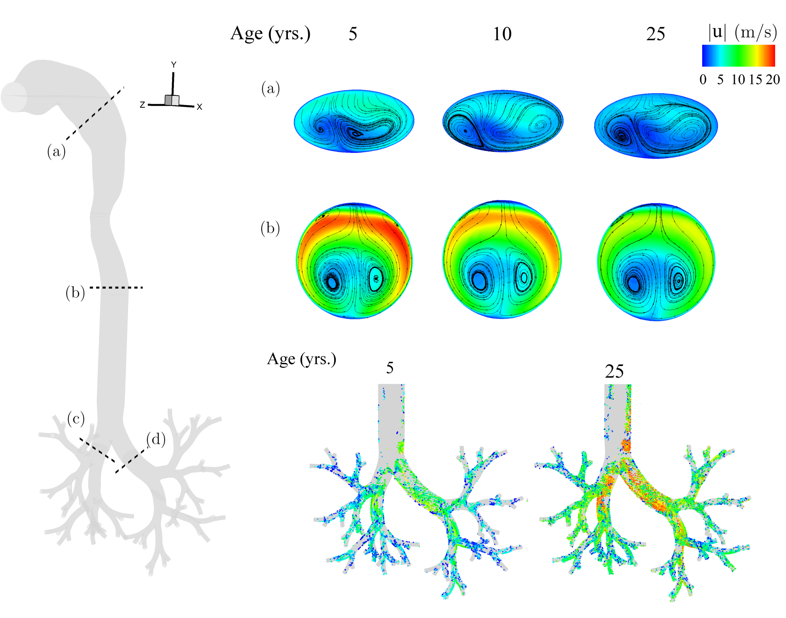

## Research and educational background

Postdoctoral Fellow - Lab of Turbulent Flows (University of Alberta, Canada)
2018 - 2020

Postdoctoral Fellow - Biofluids Lab (Technion - Israel Institute of Technology, Israel)
2016 - 2018

PhD (Mechanical Engineering) - Flow Physics Lab (Indian Institute of Science, India)
2016

MSc (Mechanical Engineering) - Flow Physics Lab (Indian Institute of Science, India)
2009

### A brief visual overview of my research projects

Click on the images to navigate to the research publication.

#### Unsteady jets with hinged-rigid leaflets 
<a href="https://doi.org/10.1017/jfm.2013.356"> 
 
#### Unsteady jets with deformable (flexible) leaflets  
<a href="https://doi.org/10.1017/jfm.2018.230">

#### 3D Particle Tracking Velocimetry of flow turbulence
<a href="https://doi.org/10.1103/PhysRevFluids.5.114605"> 

#### Aerosol deposition in upper airways of lungs (CFD) - implications with age

