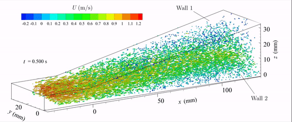
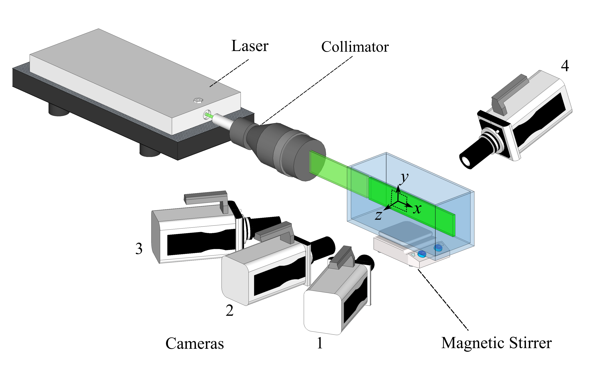
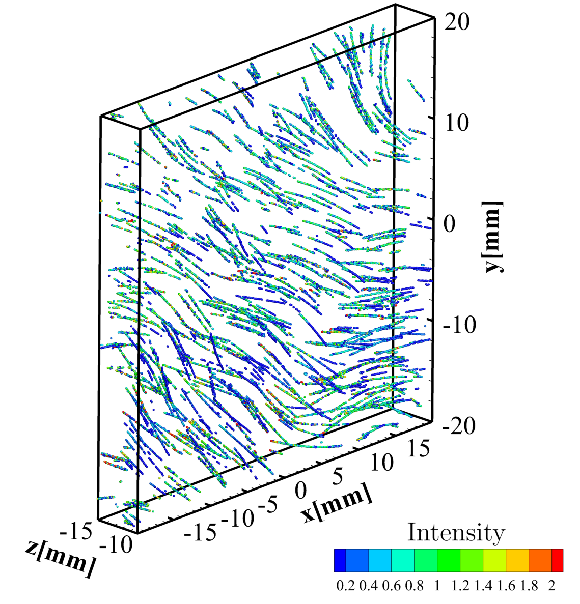
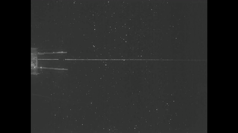

### Gallery of selected works
Clicking on each image will take you to its corresponding publication's page.

#### 3D Particle Tracking Velocimetry (3D-PTV) of flow turbulence in a diffuser
<a href="https://doi.org/10.1103/PhysRevFluids.5.114605"> 

#### Light-scattering characteristics of tracer particles with multiple viewing angles
<a href="https://doi.org/10.1088/1361-6501/abf25c"> <a href="https://doi.org/10.1088/1361-6501/abf25c">

#### Aerosol deposition in upper airways of lungs using CFD - implications with age
<a href="https://doi.org/10.1371/journal.pone.0207711" ><a href="https://doi.org/10.1371/journal.pone.0207711" >

#### Unsteady jets with deformable (flexible) leaflets  
<a href="https://doi.org/10.1017/jfm.2018.230">
  
#### Unsteady jets with hinged-rigid leaflets 
<a href="https://doi.org/10.1017/jfm.2013.356">
  
#### Prey capturing dynamics of dragonfly nymph

